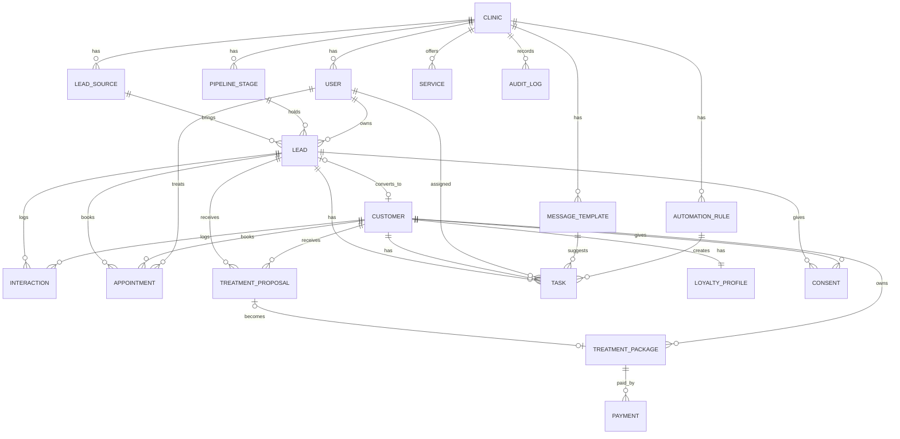

# Clinic Revenue OS — מודל נתונים

> PostgreSQL / Supabase. בידוד Multi-tenant באמצעות `clinic_id` + Row-Level Security.
> מבוסס על סעיף 10 ב-[PRODUCT_SPEC.md](PRODUCT_SPEC.md).

## 1. ERD



## 2. סכמת SQL

```sql
-- ===== Enums =====
create type user_role        as enum ('owner','manager','sales','therapist');
create type stage_type       as enum ('open','won','lost');
create type response_status  as enum ('none','contacted','no_answer','replied');
create type appt_type        as enum ('consultation','treatment','check','followup');
create type appt_status      as enum ('scheduled','confirmed','cancelled','no_show','completed');
create type proposal_status  as enum ('draft','sent','accepted','declined','expired');
create type payment_type     as enum ('deposit','full');
create type payment_state    as enum ('pending','partial','paid','refunded');
create type task_status      as enum ('open','done','snoozed','irrelevant');
create type interaction_type as enum ('call','whatsapp','note','stage_change','appointment','proposal','system','form');
create type consent_channel  as enum ('whatsapp','sms','email','phone');
create type consent_kind     as enum ('service','marketing');
create type loyalty_tier     as enum ('new','active','vip');

-- ===== Core =====
create table clinics (
  id uuid primary key default gen_random_uuid(),
  name text not null,
  slug text unique not null,
  timezone text not null default 'Asia/Jerusalem',
  working_hours jsonb not null default '{}',   -- {"sun":["09:00","19:00"],...}
  settings jsonb not null default '{}',
  created_at timestamptz default now(), updated_at timestamptz default now()
);

create table users (
  id uuid primary key references auth.users(id),
  clinic_id uuid not null references clinics(id),
  full_name text not null,
  email text not null,
  role user_role not null,
  active boolean not null default true,
  created_at timestamptz default now(), updated_at timestamptz default now()
);

create table lead_sources (
  id uuid primary key default gen_random_uuid(),
  clinic_id uuid not null references clinics(id),
  name text not null,                    -- Instagram/Facebook/Google/Site/WhatsApp/Phone/Referral/Other
  campaign text,
  active boolean default true
);

create table pipeline_stages (
  id uuid primary key default gen_random_uuid(),
  clinic_id uuid not null references clinics(id),
  name text not null,
  position int not null,
  type stage_type not null default 'open',
  sla_hours int,
  unique (clinic_id, position)
);

create table services (
  id uuid primary key default gen_random_uuid(),
  clinic_id uuid not null references clinics(id),
  name text not null,
  default_price numeric(10,2),
  default_sessions int default 1,
  maintenance_days int,                 -- לתזכורת טיפול תחזוקה
  active boolean default true
);

-- ===== People =====
create table leads (
  id uuid primary key default gen_random_uuid(),
  clinic_id uuid not null references clinics(id),
  full_name text not null,
  phone text not null,                  -- E.164
  email text,
  source_id uuid references lead_sources(id),
  campaign text,
  service_id uuid references services(id),
  stage_id uuid not null references pipeline_stages(id),
  owner_user_id uuid references users(id),
  expected_value numeric(10,2) default 0,
  response_status response_status not null default 'none',
  next_action text,
  next_action_at timestamptz,
  lost_reason text,
  first_response_at timestamptz,
  notes text,
  customer_id uuid,                     -- FK נוסף אחרי יצירת customers
  created_at timestamptz default now(), updated_at timestamptz default now(),
  unique (clinic_id, phone)
);

create table customers (
  id uuid primary key default gen_random_uuid(),
  clinic_id uuid not null references clinics(id),
  lead_id uuid references leads(id),
  full_name text not null,
  phone text not null,
  email text,
  birthday date,
  status text not null default 'active',   -- active/dormant/lost
  last_visit_at timestamptz,
  next_recommended_at timestamptz,
  churn_risk boolean not null default false,
  anonymized_at timestamptz,
  created_at timestamptz default now(), updated_at timestamptz default now(),
  unique (clinic_id, phone)
);
alter table leads add constraint leads_customer_fk foreign key (customer_id) references customers(id);

-- ===== Sales objects =====
create table appointments (
  id uuid primary key default gen_random_uuid(),
  clinic_id uuid not null references clinics(id),
  lead_id uuid references leads(id),
  customer_id uuid references customers(id),
  therapist_user_id uuid references users(id),
  type appt_type not null,
  status appt_status not null default 'scheduled',
  starts_at timestamptz not null,
  ends_at timestamptz not null,
  notes text,
  check (lead_id is not null or customer_id is not null)
);

create table treatment_proposals (
  id uuid primary key default gen_random_uuid(),
  clinic_id uuid not null references clinics(id),
  lead_id uuid references leads(id),
  customer_id uuid references customers(id),
  service_id uuid references services(id),
  description text,
  sessions int not null default 1,
  price numeric(10,2) not null,
  valid_until date,
  status proposal_status not null default 'draft',
  sent_at timestamptz,
  decided_at timestamptz,
  decline_reason text
);

create table treatment_packages (
  id uuid primary key default gen_random_uuid(),
  clinic_id uuid not null references clinics(id),
  customer_id uuid not null references customers(id),
  proposal_id uuid references treatment_proposals(id),
  service_id uuid references services(id),
  total_sessions int not null,
  used_sessions int not null default 0,
  price numeric(10,2) not null,
  last_session_at timestamptz,
  created_at timestamptz default now(),
  check (used_sessions <= total_sessions)
);

create table payments (
  id uuid primary key default gen_random_uuid(),
  clinic_id uuid not null references clinics(id),
  package_id uuid references treatment_packages(id),
  proposal_id uuid references treatment_proposals(id),
  amount numeric(10,2) not null,
  type payment_type not null,
  state payment_state not null default 'pending',
  paid_at timestamptz
);

-- ===== Work & comms =====
create table message_templates (
  id uuid primary key default gen_random_uuid(),
  clinic_id uuid not null references clinics(id),
  name text not null,
  trigger_key text,                     -- new_lead, no_answer, reminder, proposal_followup_3d, dormant_90d ...
  body text not null,                   -- {name} {service} {time} {clinic} {link}
  channel text not null default 'whatsapp',
  is_marketing boolean not null default false,
  active boolean default true
);

create table automation_rules (
  id uuid primary key default gen_random_uuid(),
  clinic_id uuid not null references clinics(id),
  key text not null,                    -- R01..R15
  enabled boolean not null default true,
  params jsonb not null default '{}',   -- {"minutes":15} / {"days":[3,7,14]}
  unique (clinic_id, key)
);

create table tasks (
  id uuid primary key default gen_random_uuid(),
  clinic_id uuid not null references clinics(id),
  lead_id uuid references leads(id),
  customer_id uuid references customers(id),
  assignee_user_id uuid references users(id),
  type text not null,
  reason text,
  due_at timestamptz not null,
  status task_status not null default 'open',
  outcome text,
  template_id uuid references message_templates(id),
  rule_id uuid references automation_rules(id),
  snoozed_until timestamptz,
  completed_at timestamptz,
  created_at timestamptz default now()
);

create table interactions (
  id uuid primary key default gen_random_uuid(),
  clinic_id uuid not null references clinics(id),
  lead_id uuid references leads(id),
  customer_id uuid references customers(id),
  user_id uuid references users(id),
  type interaction_type not null,
  content text,
  ai_generated boolean not null default false,
  meta jsonb default '{}',
  occurred_at timestamptz not null default now()
);

-- ===== Loyalty & consent =====
create table loyalty_profiles (
  customer_id uuid primary key references customers(id),
  clinic_id uuid not null references clinics(id),
  is_member boolean not null default false,
  joined_at date,
  tier loyalty_tier not null default 'new',
  points int not null default 0,
  benefit_available text,
  last_benefit_at timestamptz
);

create table consents (
  id uuid primary key default gen_random_uuid(),
  clinic_id uuid not null references clinics(id),
  lead_id uuid references leads(id),
  customer_id uuid references customers(id),
  channel consent_channel not null,
  kind consent_kind not null,
  granted boolean not null,
  source text,                          -- form/verbal/import
  granted_at timestamptz,
  revoked_at timestamptz,
  do_not_contact boolean not null default false
);

create table audit_logs (
  id bigint generated always as identity primary key,
  clinic_id uuid not null,
  user_id uuid,
  entity text not null,
  entity_id uuid,
  action text not null,
  before jsonb, after jsonb,
  screen text,
  at timestamptz default now()
);

-- ===== אינדקסים מרכזיים =====
create index on leads (clinic_id, stage_id);
create index on leads (clinic_id, owner_user_id, next_action_at);
create index on leads (clinic_id, response_status, created_at);
create index on tasks (clinic_id, assignee_user_id, status, due_at);
create index on appointments (clinic_id, starts_at);
create index on appointments (therapist_user_id, starts_at);
create index on interactions (lead_id, occurred_at desc);
create index on interactions (customer_id, occurred_at desc);
create index on customers (clinic_id, last_visit_at);
```

## 3. RLS

```sql
-- פונקציות עזר
create function auth_clinic() returns uuid language sql stable as
  $$ select clinic_id from users where id = auth.uid() $$;
create function auth_role() returns user_role language sql stable as
  $$ select role from users where id = auth.uid() $$;

-- דפוס בסיס לכל טבלה עם clinic_id (חוזרים על אותו דפוס בכל הטבלאות):
alter table leads enable row level security;
create policy leads_tenant on leads
  using (clinic_id = auth_clinic());

-- הגבלות לפי תפקיד:
-- מזכירה: לידים שלה או לא מוקצים
create policy leads_sales on leads as restrictive for select
  using (auth_role() <> 'sales' or owner_user_id = auth.uid() or owner_user_id is null);
-- מטפלת: אין גישה ללידים
create policy leads_no_therapist on leads as restrictive for all
  using (auth_role() <> 'therapist');
-- מטפלת: פגישות שלה בלבד
create policy appt_therapist on appointments as restrictive for select
  using (auth_role() <> 'therapist' or therapist_user_id = auth.uid());
-- הכנסות (payments, proposals price): owner/manager בלבד
create policy pay_finance on payments as restrictive for select
  using (auth_role() in ('owner','manager'));
```

## 4. שלבי Pipeline ברירת מחדל (seed)

| מיקום | שם | סוג | SLA |
|---|---|---|---|
| 1 | ליד חדש | open | 15 דק׳ |
| 2 | ממתין למענה | open | 24 ש׳ |
| 3 | נוצר קשר | open | 48 ש׳ |
| 4 | נקבע ייעוץ | open | — |
| 5 | הגיע לייעוץ | open | 24 ש׳ (שליחת הצעה) |
| 6 | נשלחה הצעת טיפול | open | 3 ימים |
| 7 | ממתין להחלטה | open | 7 ימים |
| 8 | נסגר לטיפול | won | — |
| 9 | בטיפול / סדרת טיפולים | won | — |
| 10 | לקוח לשימור / טיפול חוזר | won | 90 ימים |
| 11 | אבוד / לא רלוונטי | lost | — |

## 5. כללי אינטגריטי

- **המרה:** יצירת `customer` מ-`lead` בטרנזקציה אחת (מעתיקה פרטים, מעדכנת `leads.customer_id`, יוצרת `loyalty_profile` ריק, מעבירה `consents`).
- **טלפון:** נשמר ב-E.164 (`+972…`), ייחודי ל-clinic (מניעת כפילויות; ייבוא CSV מזהה כפילות).
- **אנונימיזציה:** `customers.anonymized_at` + החלפת שם/טלפון/אימייל בערכי placeholder, ניקוי `interactions.content`; `audit_logs` נשמר.
- **`do_not_contact`:** הודעה שיווקית (`is_marketing=true`) נחסמת ברמת ה-API.
- **`next_action` חובה** לליד בשלב `open` (נאכף ב-API ולא ב-DB, כדי לא לחסום קליטה).
- **מדדים** (KPI) נגזרים מ-View/RPC ולא נשמרים: `first_response_at - created_at`, ספירות לפי שלב, סכום `expected_value` פתוח וכו'.
