# Clinic Revenue OS — Sitemap

> נגזר מ-[PRODUCT_SPEC.md](PRODUCT_SPEC.md). 7 מודולים ראשיים + מסכים משניים וציבוריים.
> מקרא הרשאות: **O** בעלת קליניקה · **M** מנהלת · **S** מזכירה/נציגה · **T** מטפלת · ✔ מלא · ◐ מוגבל · ✖ אין גישה

## 1. מבנה ניווט

```mermaid
flowchart TD
  L[התחברות / איפוס סיסמה] --> APP[האפליקציה]
  APP --> D[1. דשבורד]
  APP --> LE[2. לידים]
  APP --> C[3. לקוחות]
  APP --> T[4. משימות ופולואפ]
  APP --> CAL[5. יומן וייעוצים]
  APP --> R[6. הכנסות והמרות]
  APP --> S[7. הגדרות]

  LE --> LE1[Kanban]
  LE --> LE2[טבלה]
  LE --> LE3[ליד חדש / ייבוא CSV]
  LE --> CARD[כרטיס ליד/לקוחה]
  C --> C1[כל הלקוחות]
  C --> C2[לקוחות רדומות]
  C --> C3[מועדון]
  C --> CARD
  CARD --> CT1[סיכום] & CT2[ציר זמן] & CT3[משימות] & CT4[תורים] & CT5[הצעות] & CT6[טפסים ומסמכים] & CT7[טיפולים וחבילות] & CT8[נאמנות ושימור]
  T --> T1[באיחור] & T2[להיום] & T3[מחר / השבוע] & T4[רדומות] & T5[הצעות פתוחות] & T6[ללא מענה] & T7[אי-הגעות]
  CAL --> CAL1[יום] & CAL2[שבוע] & CAL3[פגישה חדשה]
  R --> R1[Funnel] & R2[הכנסה לפי מקור/טיפול/עובדת] & R3[סיבות אובדן] & R4[שימור וחוזרות] & R5[כסף בסיכון]
  S --> S1[משתמשים ותפקידים] & S2[מקורות לידים] & S3[שירותים ומחירון] & S4[תבניות הודעה] & S5[שעות פעילות ו-SLA] & S6[חוקי אוטומציה] & S7[מועדון והטבות] & S8[פרטיות והסכמות] & S9[טופס ליד / שאלון] & S10[יומן ביקורת]

  PUB[מסכים ציבוריים] --> P1[טופס ליד] & P2[שאלון לפני ייעוץ] & P3[הסרה מדיוור]
```

## 2. טבלת מסכים ונתיבים

| # | מסך | נתיב | O | M | S | T | שאלה עסקית |
|---|---|---|---|---|---|---|---|
| 0 | התחברות | `/login` | ✔ | ✔ | ✔ | ✔ | — |
| 1 | דשבורד | `/dashboard` | ✔ | ✔ | ◐ (בלי הכנסות) | ◐ (יומן+משימות שלה) | איפה אני מאבדת הכנסה? |
| 2 | לידים – Kanban | `/leads` | ✔ | ✔ | ✔ (שלה+לא מוקצים) | ✖ | מי בצנרת ובאיזה שלב? |
| 2a | לידים – טבלה | `/leads?view=table` | ✔ | ✔ | ✔ | ✖ | |
| 2b | ליד חדש | `/leads/new` | ✔ | ✔ | ✔ | ✖ | |
| 2c | ייבוא CSV | `/leads/import` | ✔ | ✔ | ✖ | ✖ | |
| 3 | לקוחות | `/customers` | ✔ | ✔ | ✔ | ◐ (רק שלה) | מי הלקוחות? |
| 3a | רדומות | `/customers/dormant` | ✔ | ✔ | ✔ | ✖ | את מי מחזירים? |
| 3b | מועדון | `/customers/loyalty` | ✔ | ✔ | ◐ קריאה | ✖ | |
| 3c | כרטיס ליד/לקוחה | `/leads/:id`, `/customers/:id` | ✔ | ✔ | ✔ | ◐ | מה המצב והצעד הבא? |
| 4 | משימות ופולואפ | `/tasks` | ✔ | ✔ | ✔ (שלה) | ◐ (שלה) | מה עושים עכשיו? |
| 5 | יומן | `/calendar` | ✔ | ✔ | ✔ | ◐ (אישי) | מי מגיעה ומתי? |
| 5a | פגישה חדשה | `/calendar/new` | ✔ | ✔ | ✔ | ✖ | |
| 6 | הכנסות והמרות | `/reports` | ✔ | ✔ | ✖ | ✖ | מה מכניס ומה דולף? |
| 6a | כסף בסיכון | `/reports/at-risk` | ✔ | ✔ | ✖ | ✖ | |
| 7 | הגדרות – כללי | `/settings` | ✔ | ◐ | ✖ | ✖ | |
| 7a | משתמשים | `/settings/users` | ✔ | ✖ | ✖ | ✖ | |
| 7b | מקורות | `/settings/sources` | ✔ | ✔ | ✖ | ✖ | |
| 7c | שירותים ומחירון | `/settings/services` | ✔ | ✔ | ✖ | ✖ | |
| 7d | תבניות | `/settings/templates` | ✔ | ✔ | ✖ | ✖ | |
| 7e | חוקי אוטומציה | `/settings/automations` | ✔ | ◐ | ✖ | ✖ | |
| 7f | מועדון והטבות | `/settings/loyalty` | ✔ | ✔ | ✖ | ✖ | |
| 7g | פרטיות והסכמות | `/settings/privacy` | ✔ | ✖ | ✖ | ✖ | |
| 7h | יומן ביקורת | `/settings/audit` | ✔ | ✖ | ✖ | ✖ | |
| P1 | טופס ליד ציבורי | `/f/:clinicSlug` | ציבורי | | | | |
| P2 | שאלון ציבורי | `/q/:token` | ציבורי (טוקן) | | | | |
| P3 | הסרה מדיוור | `/unsubscribe/:token` | ציבורי (טוקן) | | | | |

## 3. תבנית ניווט

- **דסקטופ:** סרגל צד ימני (RTL) עם 7 מודולים; כותרת עליונה: חיפוש גלובלי, "+ ליד חדש", פעמון, פרופיל.
- **מובייל:** סרגל תחתון עם 5 פריטים (דשבורד, לידים, משימות, יומן, עוד); כפתור "+" צף.
- **חיפוש גלובלי:** שם / טלפון → כרטיס ליד/לקוחה.
- **Deep links:** כל KPI ו"פעולה דחופה" בדשבורד מוביל לרשימה מסוננת (למשל `/leads?status=unanswered`).
